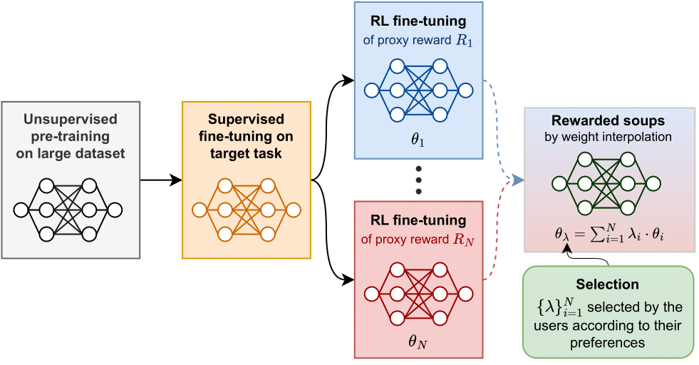

# Rewarded soups: towards Pareto-optimal alignment by interpolating weights fine-tuned on diverse rewards. NeurIPS 2023.

[Alexandre Ramé](https://alexrame.github.io/), [Guillaume Couairon](https://scholar.google.com/citations?user=O1DeDyEAAAAJ&hl), [Mustafa Shukor](https://scholar.google.com/citations?user=lhp9mRgAAAAJ), [Corentin Dancette](https://cdancette.fr/), [Jean-Baptiste Gaya](https://www.isir.upmc.fr/personnel/gaya), [Laure Soulier](https://www.isir.upmc.fr/personnel/soulier/) and [Matthieu Cord](http://webia.lip6.fr/~cord/)

Repository to reproduce the main results from our [paper](https://arxiv.org/abs/2306.04488). The interactive demos are available on our [website](https://alexrame-rewardedsoups-streamlit-apphome-pxh21g.streamlit.app/) or our [HuggingFace space](https://huggingface.co/spaces/alexrame/rewardedsoups). The reviews are available on [openreview](https://openreview.net/forum?id=lSbbC2VyCu&noteId=np0m5ACZtx).



## Abstract

Foundation models are first pre-trained on vast unsupervised datasets and then fine-tuned on labeled data. Reinforcement learning, notably from human feedback (RLHF), can further align the network with the intended usage. Yet the imperfections in the proxy reward may hinder the training and lead to suboptimal results; the diversity of objectives in real-world tasks and human opinions exacerbate the issue. This paper proposes embracing the heterogeneity of diverse rewards by following a multi-policy strategy. Rather than focusing on a single a priori reward, we aim for Pareto-optimal generalization across the entire space of preferences. To this end, we propose rewarded soup, first specializing multiple networks independently (one for each proxy reward) and then interpolating their weights linearly. This succeeds empirically because we show that the weights remain linearly connected when fine-tuned on diverse rewards from a shared pre-trained initialization. We demonstrate the effectiveness of our approach for text-to-text (summarization, Q&A, helpful assistant, review), text-image (image captioning, text-to-image generation, visual grounding, VQA), and control (locomotion) tasks. We hope to enhance the alignment of deep models, and how they interact with the world in all its diversity.

## Experiments

We have implemented rewarded soups across a variety of standard learning tasks: text-to-text generation, image captioning, image generation, visual grounding, and locomotion. We follow a systematic procedure:

- we independently optimize diverse rewards on training samples. For all tasks, we employ the default architecture, hyperparameters and RL algorithm; the only variation being the reward used across runs.
- we evaluate the rewards on the test samples: the results are visually represented in series of plots in the paper.
- we verify the linear mode connectivity by examining whether RS's rewards exceed the interpolated rewards.
- we compare the front defined by RS when sliding $\lambda$ between $0$ and $1$ to the MORL's solutions optimizing the $\mu$-weighted rewards.

When possible, we have released the shareable implementations under the corresponding folders. More experiments will be released. The procedures are further detailed in the corresponding `README.md`.

### Text-to-text experiments: LLaMA with diverse RLHFs

The code in [llama](llama/README.md) enables the reproduction of our main experiments, where we fine-tune LLaMA-7b, instruction fine-tuned on Alpaca, on five tasks: summarization (on news or on reddit), answering of stack exchange questions, movie review generation or conversational assistant.

### Image-to-text experiments: captioning with diverse statistical rewards

The code in [captioning](captioning/README.md) enables the reproduction of our image-to-text experiments, where we fine-tune the state-of-the-art weights from ExpansionNet v2 on various statistical metrics.

## Citation

If you find this code useful for your research, please consider citing our work:

```
@inproceedings{rame2023rewardedsoups,
  title   = {Rewarded soups: towards Pareto-optimal alignment by interpolating weights fine-tuned on diverse rewards},
  author  = {Ram{\'e}, Alexandre and Couairon, Guillaume and Shukor, Mustafa and Dancette, Corentin and Gaya, Jean-Baptiste and Soulier, Laure and Cord, Matthieu},
  year    = {2023},
  booktitle = {NeurIPS},
}
```
